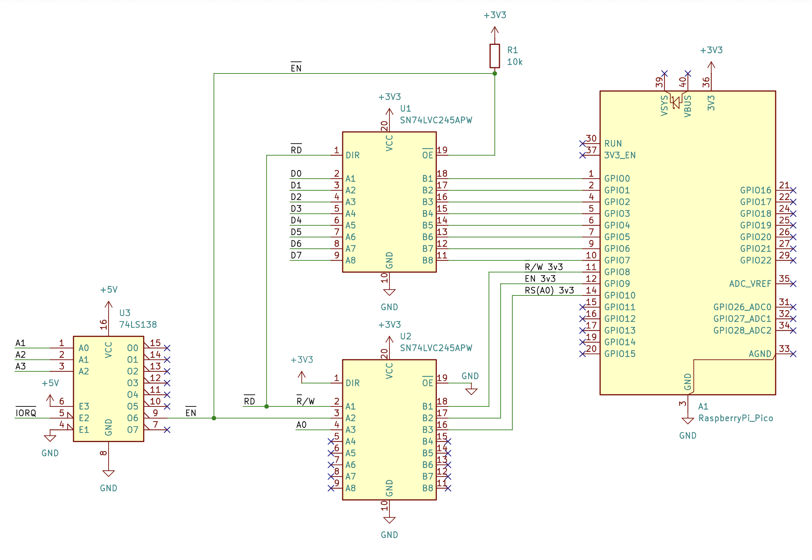
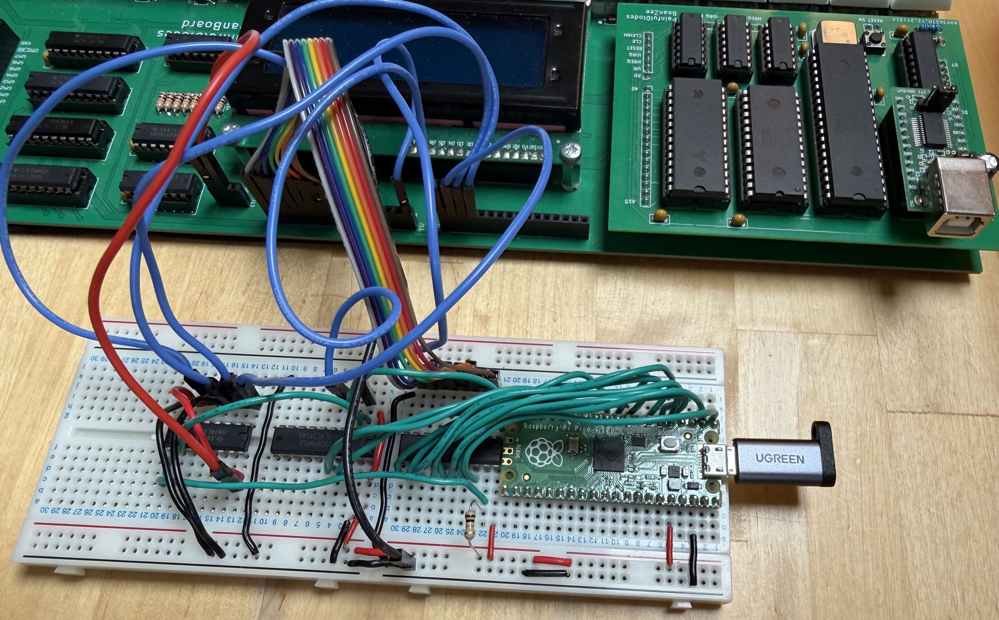

# BeanPort

Raspberry Pi Pico firmware providing a USB bridge for retrocomputers.

Most homebrew retrocomputing designs provide a UART interface and use an FTDI UART-to-USB adapter to connect to a modern host computer. This means dealing with baud rates, and either fixing the CPU clock to a UART-friendly rate, or having a separate clock for the UART.

BeanPort provides an alternative solution: using a Pico, with its own USB interface, to replace the UART and FTDI adapter on the retro target.

The FTDI UM245R USB-to-parallel-FIFO module provides a similar function, but the Pico is lower cost and more readily available. It also has further potential through the Pico's SDK and additional capabilities.

The Pico presents as a two-register, 8-bit parallel interface to the target system's bus.

The USB appears as a standard CDC-ACM USB device (Abstract Control Model Communications Device Class) which the host computer recognises with a standard driver to deliver a VCP (Virtual COM Port) — on macOS: `/dev/cu.usbmodemXXXX`

USB CDC is provided by [TinyUSB](https://github.com/hathach/tinyusb) within the Pico SDK.

(By comparison, the UM245R communicates with an FTDI-specific driver on the host system, which also typically presents the device to the host as a VCP.)

Bytes flow transparently with buffering in both directions, so you can run a virtual terminal — PuTTY, screen, minicom, CoolTerm etc. — on the host computer to access the retrocomputer.

## Status

Tested with a Z80 homebrew target system and a macOS host with `screen` serial terminal emulator.

## Target Interface

BeanPort provides two 8-bit registers, distinguished by a Register Select (RS) input (which will typically be mapped to the target's A0):

| RS/A0 | Name   | Access     | Meaning                                                                                    |
|-------|--------|------------|--------------------------------------------------------------------------------------------|
| 0     | STATUS | read-only  | bit 0 = read-available, bit 1 = write-ready (matches the 6850 ACIA's RDRF/TDRE convention) |
| 1     | DATA   | read/write | write = byte to send to the host; read = byte received from the host                       |

The target will also provide an enable (EN#) signal, plus any logic that is needed to produce R/W. For a Z80 target: RD# maps directly to R/W.

Reading DATA when none is available returns `0x00`.

## Hardware

BeanPort should work with all current Raspberry Pi Pico variants: Pico (RP2040) and Pico 2 (RP2350), and wireless (`W`) versions. To date, It has only tested with a non-wireless RP2040.

Example schematic:

[kicad/beanport.pdf](kicad/beanport.pdf)

Breadboard prototype:

## Building and flashing

The repo's uf2 files can be transferred to Pico with standard BOOTSEL. Binary location: `build/<target>/bin/beanport.uf2`

Firmware can be built from source — see Pico documentation for build toolchain / process.

Each board gets its own build directory, e.g. `build/pico2_w/`

## License

MIT — see [LICENSE](LICENSE).

## Links

- [BeanZee](https://github.com/PainfulDiodes/BeanZee)
- [BeanBoard](https://github.com/PainfulDiodes/BeanBoard)
- [Blog](https://painfuldiodes.wordpress.com/category/beanport/)
